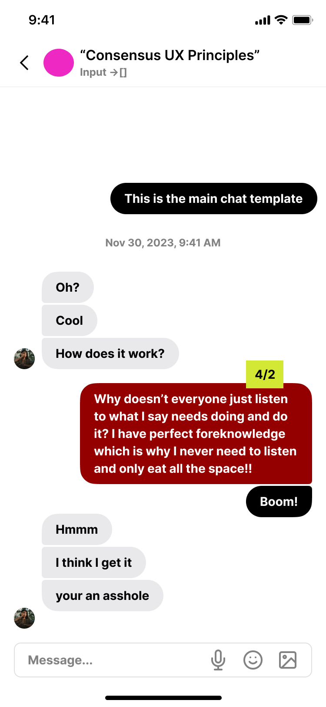
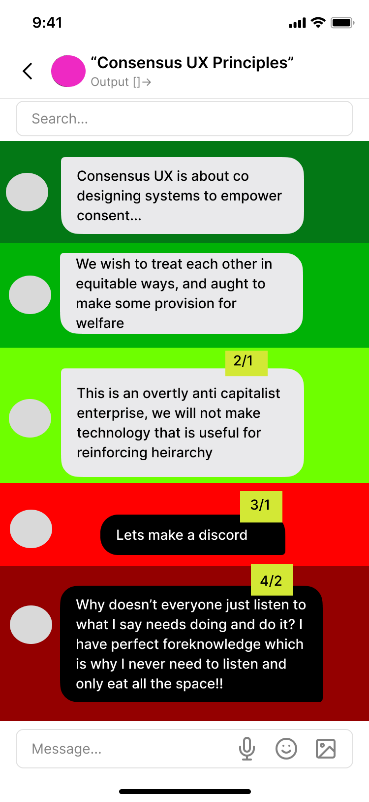
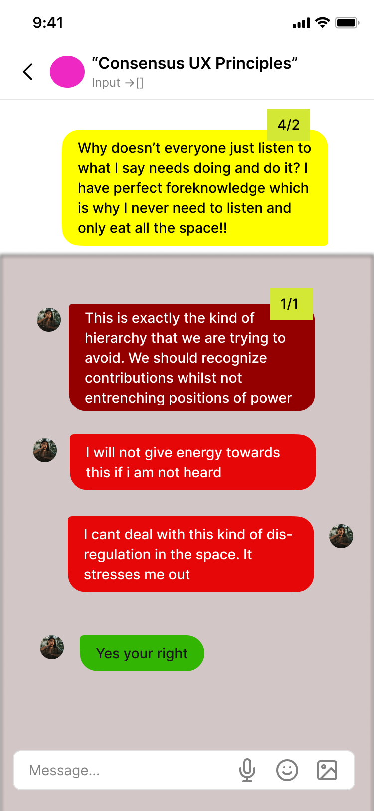
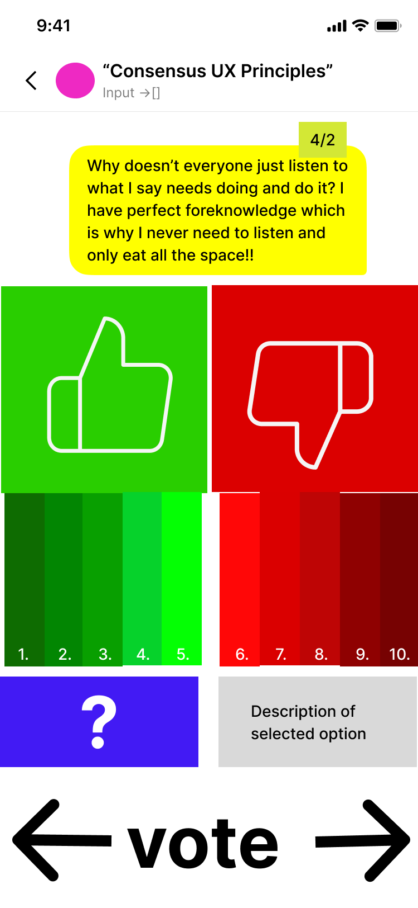
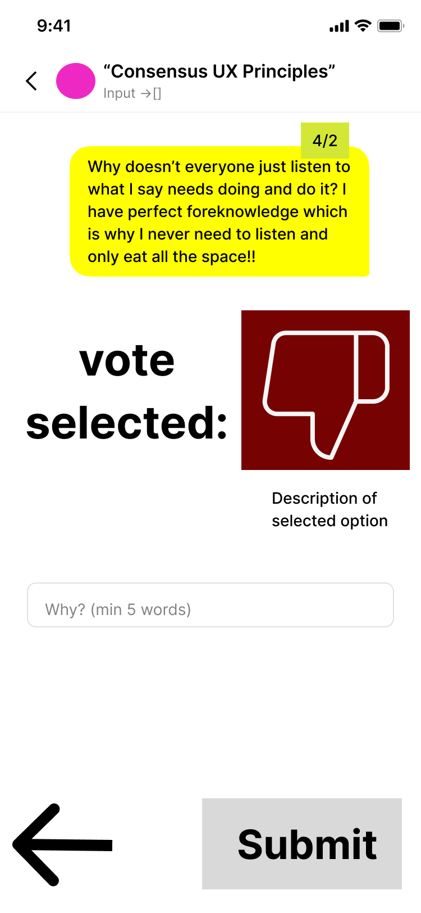

# Core Flow

> This feature is planned. No production code has been written.
{: .planned }

The Core Flow is the consensus mechanics engine — the central value proposition of ConsensusUX. It transforms a messaging app into a decision-making tool by layering structured consent evaluation on top of ordinary conversation.

---

## Overview

Every conversation in ConsensusUX is actually **two conversations**:

- An **input chat** for raw discussion, questions, and proposals — similar to a normal messaging app
- An **output chat** where proposals are sorted by degree of consent — a structured view where high-consensus items rise and contentious items sink

The mechanism connecting them is the **consent check**: a tap-and-hold gesture that opens a judgment UI, where members rate proposals on a binary or granular scale and must provide written reasoning. Judgments are posted as **chain messages** attached to the original proposal, and can themselves be judged, creating nested chains of deliberation.

---

## Dual Chat Architecture

### Input Chat

The input chat is the discussion space. It behaves like a conventional messaging interface:
- Members post messages freely
- Messages appear in chronological order
- Any message can become the subject of a consent check
- Chain messages (judgments and responses) appear nested under their parent

### Output Chat

The output chat is an organized, consent-sorted view of the same content:
- Proposals are ordered by their **green\_score** (highest consent at the top)
- Proposals that have reached a **red\_score ≥ 1** are moved to a separate **red section** with reduced visibility
- Within the red section, proposals are ordered by red\_score (most contentious at the bottom)
- The output chat is searchable by keyword
- Prospective members (pre-vouching) may have read access to high-consensus content; red section content is hidden from prospective members by default

Navigation between input and output is available from the main chat screen.

---

## The Consent Check

The consent check is the core interaction pattern. It is activated by a **tap-and-hold** gesture on any message.

### Judgment Modes

**Binary Mode**
- Thumbs up (green) — consent
- Thumbs down (red) — dissent

**Degrees of Resistance Mode**
- Scale from 1 to 10
- 1 = enthusiastic consent
- 10 = hard no / strong objection

In both modes, the user **must provide written reasoning** before submitting. A minimum word count is enforced.

The submitted judgment is posted as a **chain message** attached to the original proposal and contributes to that proposal's running score.

---

## Scoring Algorithm

Scores are recalculated each time a new judgment is submitted. Each proposal carries two scores: `green_score` and `red_score`.

### Score Contributions by Judgment Value

| Judgment | Contribution |
|----------|-------------|
| Binary thumbs up | `green_score` +contribution |
| Degrees 1–2 | Strong `green_score` contribution |
| Degree 3 | Moderate `green_score` contribution |
| Degrees 4–5 | Weak contribution to either score (ambivalent zone) |
| Degrees 6–7 | Moderate `red_score` contribution |
| Degree 8 | Strong `red_score` contribution |
| Degrees 9–10 | Hard `red_score` contribution |
| Binary thumbs down | `red_score` +contribution |

### Example Calculations

These examples are drawn from the dissertation:

| Judgments | Result |
|-----------|--------|
| Thumbs up (3 members) | `green_score → 0.75` |
| Thumbs down, 8 (degrees) | `red_score → 0.75` |
| Binary 2, 1 (degrees) | `green_score → 1.0` |
| Binary 9, 10 (degrees) | `red_score → 1.0` |

### Ordering Rules

```
if red_score >= 1:
    → proposal appears in red section
    → ordered by red_score descending (higher = less visible, deeper in section)
else:
    → proposal ordered by green_score descending (higher = top of output chat)
```

> A `red_score` of 1.0 or above is the threshold for the red section — it represents a group-wide hard objection. A proposal can have a high `green_score` and still fall into the red section if it also has a sufficiently strong objection from even one member.
{: .note }

---

## Chain Messages

Chain messages are judgments posted in response to a proposal or another judgment. They create a nested deliberation structure.

### How Chains Work

1. User performs a tap-and-hold on any message — including an existing judgment
2. Consent check UI opens for that message
3. User submits a judgment with reasoning
4. The judgment is posted as a chain message nested under the parent
5. The chain message also contributes to the **original proposal's score** (propagation formula TBD)

### Chain Depth Badge

Each message with attached chain messages displays an **X/Y badge**:
- **X** — number of direct (first-level) judgments
- **Y** — maximum depth of the chain below this message

This gives members a quick signal of how much deliberation a proposal has attracted.

### Addressing Concerns

When a chain message directly addresses and resolves a concern that generated a red judgment, the resolution can **cancel out** that red score contribution. The exact propagation formula is an open question.

---

## Visibility & Privacy

| Context | Visibility |
|---------|------------|
| Prospective members (pre-vouch) | High-consensus output chat content only |
| Red section content | Hidden from prospective members by default |
| Federated groups | Configurable per chat (see [Settings](settings)) |
| External websites | Configurable per chat (see [Settings](settings)) |

### Color-Blind Accessibility

The red/green scoring system includes a **texture differentiation mode** for color-blind users. Instead of relying on hue alone, the UI uses distinct textures or patterns to distinguish consent levels. This is configurable in per-user settings.

---

## Notifications

| Event | Notification Behavior |
|-------|-----------------------|
| New message in subscribed chat | Red dot indicator |
| New chain message on own proposal | Push notification |
| Soft lock initiated | Push notification (see [Soft Lock Disputes](soft-lock-disputes)) |
| Vouch request | Push notification |

> Push notifications **never** include message preview text. This is a hard security constraint. A notification that leaks message content can expose sensitive group communications to anyone who sees the lock screen.
{: .warning }

---

## Wireframes











---

## Technical Spec

### Data Model

```
Message
  id                  uuid
  chat_id             FK → Chat
  author_id           FK → User
  content             text
  created_at          timestamp
  parent_message_id   FK → Message (null for root messages)

Chat
  id                  uuid
  group_id            FK → Group
  type                enum(input | output)
  settings            FK → ChatSettings

Judgment
  id                  uuid
  message_id          FK → Message
  judge_id            FK → User
  type                enum(binary | degrees)
  value               integer   (1–10 for degrees; 1=up, 0=down for binary)
  reasoning           text
  created_at          timestamp

ProposalScore
  message_id          FK → Message (unique)
  green_score         float
  red_score           float
  judgment_count      integer
  chain_depth         integer
  last_updated        timestamp
```

### Score Computation Notes

- `ProposalScore` is recalculated on every new judgment submission
- Chain judgments propagate score effects upward to the root proposal (propagation formula is an open question)
- The output chat ordering is a **sorted view** derived from `ProposalScore` — not a separate data store
- Ordering is computed at read time or cached and invalidated on score update

---

## Open Questions

- **Chain score propagation**: What is the exact formula for how a judgment on a chain message affects the root proposal's score? Is it weighted by chain depth?
- **Chain depth limit**: How deep can chains go before performance degrades? Is a hard depth limit enforced, or is deep nesting just visually collapsed?
- **Score recalculation timing**: Real-time recalculation on every judgment submission, or batched? Real-time is more accurate but creates write pressure at scale.
- **Proposal vs. discussion message**: Is every message a proposal, or does the system distinguish between proposals (subject to scoring) and discussion messages (not scored)? If the latter, how does a member mark a message as a proposal?
