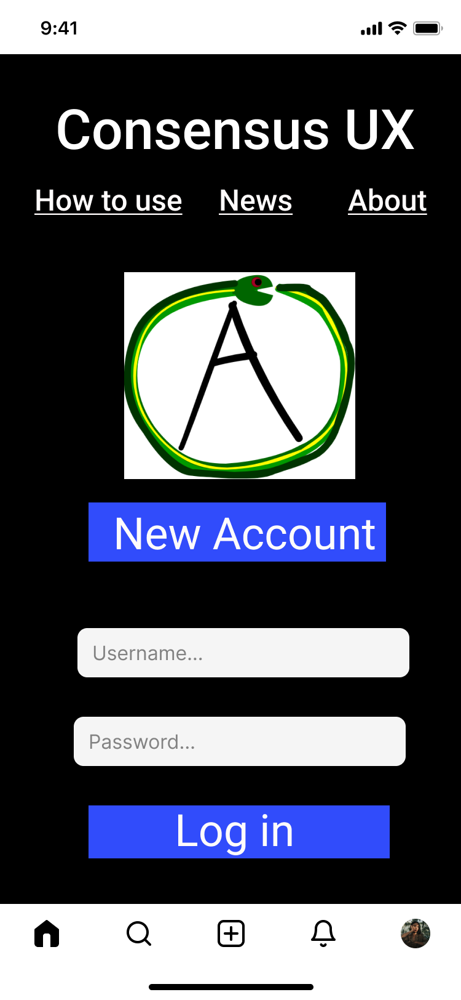
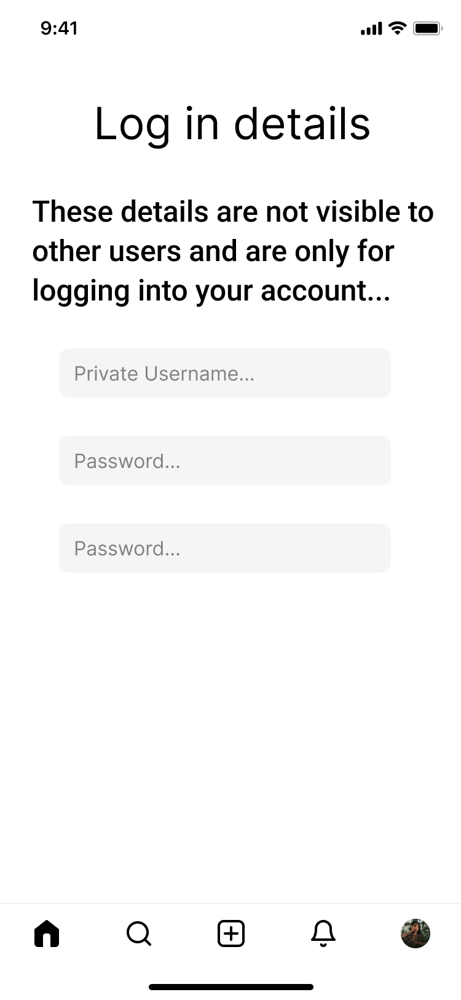
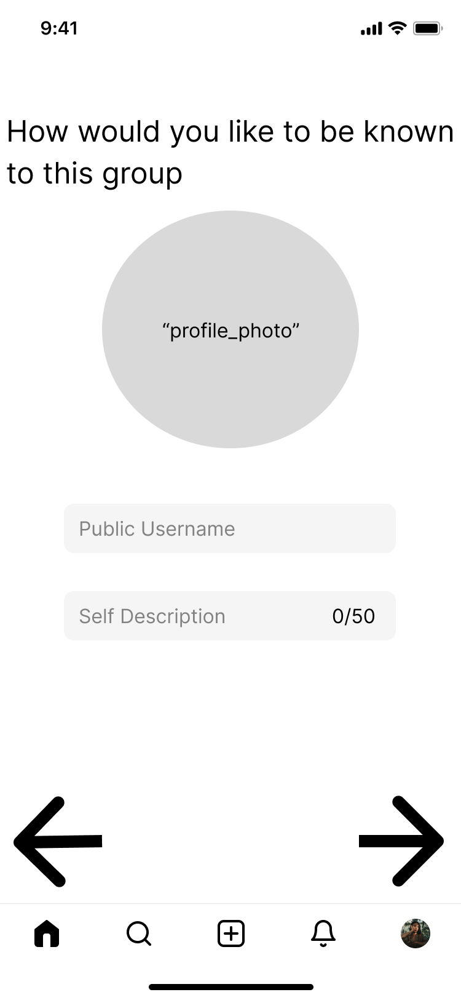

# Getting on the Network

> This feature is planned. No production code has been written.
{: .planned }

Users join ConsensusUX through a deliberate onboarding flow designed for at-risk populations: dissidents, abuse survivors, trans people, and others for whom standard account creation poses real security risks. Every design decision in this flow is intentional.

---

## Overview

The onboarding sequence moves a new user from the public-facing website through account creation, group discovery, identity setup, verification, and finally into the vouching process. The flow is designed so that:

- No personally identifying information (email, phone) is collected
- New members must be introduced by an existing member
- New members see the group's principles before committing to join
- Membership requires explicit consent and peer vouching

---

## User Flow

### 1. ConsensusUX Website
The public-facing portal provides:
- App download links
- Explainer content for prospective users
- Links to federated group outputs (where groups have opted into public visibility)

### 2. Login Screen
- Private username and password authentication
- No email registration — email is a security vulnerability for at-risk users
- No password recovery via email for the same reason

### 3. New Account Creation
- User selects a private username (used only for login, never displayed)
- Sets a password
- Completes CAPTCHA verification to prevent automated account creation

### 4. Group Discovery
After account creation, the user chooses one of two paths:
- **Create a new group** — Starts the group setup flow
- **Join an existing group** — Continues the onboarding flow below

### 5. Profile Setup
- User creates a **public username** (displayed within the group, separate from login username)
- Writes a **self-description**
- Optionally uploads a **profile photo**

> Identity is scoped per-group. A user's public username, self-description, and photo in one group are completely separate from any other group they belong to. This prevents cross-group triangulation of identity.
{: .note }

### 6. QR Code Scanning
The new member scans a QR code held by an **existing group member**. This is directional by design — the new member holds the scanning device, not the existing member.

If the camera is broken or unavailable:
- The existing member can provide a **temporary security code**
- The new member enters this code manually to achieve the same result

### 7. Group Principles Display
Before submitting a membership application, the new member views the group's **output chat containing its rules, values, and principles**. This is a read-only view — the user is not yet a member.

### 8. Consent Checkbox
The user must check a box confirming they have read and consent to the group's principles, then submit their membership application.

### 9. Vouching
The new member enters a **probationary queue**. Existing members who know the candidate can vouch for them:
- The default threshold is **4 vouches**
- Each member who vouches decrements the remaining count
- Once the threshold is met, the candidate becomes a probationary member

---

## UX Rationale

| Decision | Rationale |
|----------|-----------|
| No email registration | Email is an attack vector for at-risk users. If an account is compromised or subpoenaed, email links identity across services. |
| QR held by new member, not existing | Prevents context collapse. If the existing member's device is surveilled, scanning a new member's code exposes less than if the new member scanned the existing member's permanent identity. |
| Temporary security codes | Accessibility fallback for broken cameras, low-vision users, or situations where QR scanning is impractical. |
| Identity segmented per-group | A user appearing in multiple groups with the same username enables triangulation of their full social network. Separate per-group identities mitigate this. |
| Principle display before joining | Informed consent is foundational. A member who joins without reading the principles cannot be expected to uphold them. |
| Vouching threshold | Prevents sock puppet accounts and ensures new members have at least minimal social grounding in the group before gaining access. |

---

## Wireframes









---

## Technical Spec

### Data Model

```
User
  private_username    string   (unique, used for login only)
  password_hash       string
  captcha_verified    boolean
  created_at          timestamp

GroupProfile
  user_id             FK → User
  group_id            FK → Group
  public_username     string
  self_description    text
  profile_photo       blob | url

VouchRequest
  candidate_id        FK → User
  group_id            FK → Group
  required_vouches    integer  (default: 4, configurable per group)
  vouches_received    integer
  status              enum(pending | approved | rejected)

Vouch
  voucher_id          FK → User
  candidate_id        FK → User
  group_id            FK → Group
  judgment            integer  (binary 0/1 or 1–10 scale)
  reasoning           text
  created_at          timestamp
```

### Key Implementation Notes

- Profile data is **group-scoped, not global**. There is no "global profile" table — only `GroupProfile`.
- **No email field** anywhere in the system, including user records, logs, or audit trails.
- The QR code contains a **temporary session token**, not a user identifier. The token expires after a configurable window.
- Vouch count threshold is **configurable per group** via group settings, not hardcoded.
- CAPTCHA must be evaluated for privacy implications before implementation (see Open Questions).

---

## Open Questions

- **CAPTCHA system**: reCAPTCHA has privacy concerns for at-risk users (Google data collection). Alternatives include hCaptcha, friendly CAPTCHA, or a custom proof-of-work challenge.
- **Maximum groups per user**: Is there a cap? Unlimited group membership creates triangulation risk even with per-group identity segmentation.
- **QR code expiry time**: How long is a session token valid? Too short creates friction; too long creates security risk.
- **Minimum word count for vouch reasoning**: A floor prevents pro forma vouches but a high floor creates friction for genuine vouchers.
