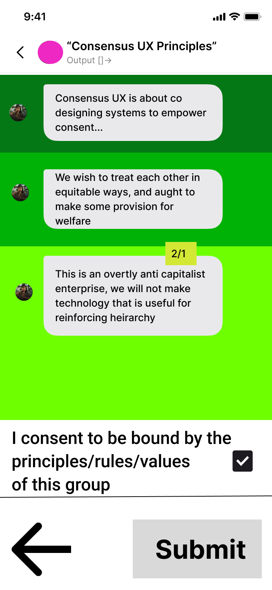

# Group Membership

> This feature is planned. No production code has been written.
{: .planned }

Groups are the core organizational unit of ConsensusUX. Every user belongs to at least one group, and all activity — chat, consensus, disputes, federation — happens within a group context. Membership is structured, tracked, and visible to all members.

---

## Overview

Group membership is not binary. Members move through tiers as they establish trust and demonstrate alignment with group principles. The full membership list is displayed as an **output chat** — a read-only, organized view that all members can inspect.

---

## Member Tiers

| Tier | Color Code | Description | Duration |
|------|------------|-------------|----------|
| Probationary | Dark green | New members who have received enough vouches to join but have not yet completed the trust period | Default 3 months |
| Full | Dark green | Members who have completed probation without incident | Ongoing |
| Provisional | Light green | Members with reduced standing (e.g. vouch count has dropped below threshold) | Variable |
| Removed | Red | Former members who have left voluntarily or been removed through soft lock | N/A |

> Removed members remain visible in the list (displayed in red) for transparency. Their presence in the record serves the group's memory — it is not punitive display.
{: .note }

---

## Members List

The members list is presented as an **output chat** — a structured, scannable view rather than a raw directory. It includes:

- All current members, sorted by tier and join date
- Former members (removed), clearly distinguished
- Color coding by tier (see table above)
- Search functionality for large groups
- Per-member summary: public username, self-description, vouch chain summary

---

## Member Profiles

Each member has a profile scoped to the group. A profile displays:

| Field | Description |
|-------|-------------|
| Public username | The name the member uses within this group (not their login username) |
| Self-description | A free-text introduction the member wrote during onboarding |
| Self-vouch | A personal statement of how and why the member aligns with group principles |
| Vouch chain | A record of who vouched for them, with their reasoning |

> All profile information is group-scoped. The same user may have a completely different public username and self-description in a different group.
{: .note }

---

## Vouching Mechanics

Vouching is the mechanism by which existing members sponsor new candidates. It is also how ongoing trust is maintained.

### Vouching a New Candidate

1. Existing member scans the candidate's QR code (or enters their temporary security code)
2. System navigates the voucher to the candidate's profile
3. Voucher gives a judgment:
   - **Binary**: yes (thumbs up) or no (thumbs down)
   - **Degrees of resistance**: 1–10 scale (1 = enthusiastic endorsement, 10 = hard no)
4. Voucher must provide reasoning (minimum word count enforced)
5. Vouch is recorded and the candidate's vouch count increments
6. Once the required number of vouches is received, the candidate transitions to **probationary** status

### Ongoing Vouch Maintenance

- Existing vouches can be refreshed or withdrawn over time
- If a member's positive vouch count drops below the group threshold, they may transition to **provisional** status
- The vouch refresh period and threshold are configurable per group via group settings

---

## Wireframes




---

## Technical Spec

### Data Model

```
GroupMember
  user_id             FK → User
  group_id            FK → Group
  tier                enum(probationary | full | provisional | removed)
  joined_at           timestamp
  probation_ends_at   timestamp

MemberProfile
  user_id             FK → User
  group_id            FK → Group
  public_username     string
  self_description    text
  self_vouch_text     text

VouchChain
  member_id           FK → User
  group_id            FK → Group
  vouches             FK[] → Vouch   (ordered list of vouch records)
```

### Key Behaviors

- **Tier transitions** are either time-based (probationary → full after the configured probation period) or event-based (any tier → removed via soft lock resolution or voluntary departure).
- A **vouch count drop** below the required threshold triggers a transition from full to provisional. The threshold is checked when any vouch is withdrawn or expires.
- **Removed members** remain in the `GroupMember` table with `tier = removed`. Their profile and vouch chain remain readable to full members.
- **Time-based vouch restrictions**: a configurable minimum time must pass before a member can vouch for a new candidate (prevents coordinated rapid-vouching of bad actors).

---

## Open Questions

- **Provisional member participation**: Can provisional members post to input chats? Can they vote in consent checks? What is their reduced-standing experience?
- **Triggers for provisional status**: Is it only a vouch count drop, or are there other triggers (e.g. losing a soft lock dispute)?
- **Appeal process**: If a member is removed, is there a formal mechanism to contest the outcome and apply for readmission?
- **Vouch withdrawal UX**: How does a member retract a vouch they previously gave, and what notification does the vouched member receive?
