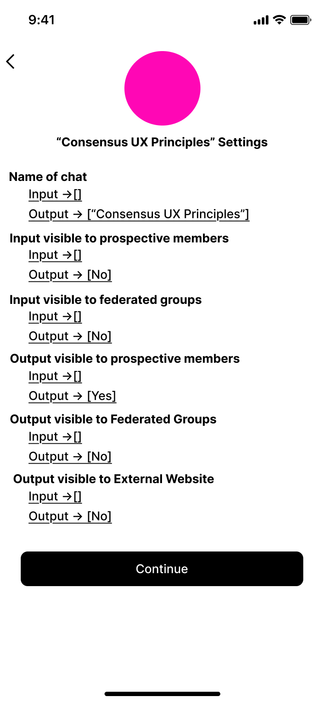

# Settings & Configuration

> This feature is planned. No production code has been written.
{: .planned }

A defining feature of ConsensusUX is that settings are not controlled by admins — they are **outputs of group consensus**. Every configurable aspect of the app is itself subject to the consent check process. A member proposes a settings change; the group deliberates; if consensus is reached, the setting updates.

---

## Overview

Settings exist at three scopes:

| Scope | Governed by | Examples |
|-------|-------------|---------|
| Per-chat | Consensus of chat participants | Visibility, consensus type, display options |
| Per-group | Group consensus | Vouch thresholds, probation duration |
| Per-user | Individual (non-consensus) | Personal notification preferences |

The distinction between per-user and group/chat settings is important: only personal preferences that have no effect on other members are controlled individually. Everything that affects the group experience requires group consensus.

---

## Safe Defaults Principle

When no group consensus exists on a setting — either because the setting has never been proposed, or because a proposal failed — the system applies the **most conservative** available option. Conservative means **least information exposure**.

> Safe defaults are hard-coded fallbacks, not consensus outcomes. They cannot be changed by a group consensus proposal. They represent the minimum viable trust posture for a group that has not yet discussed a given setting.
{: .note }

Examples of safe defaults:
- Visibility to prospective members: **off**
- Visibility to federated groups: **off**
- Visibility to external websites: **off**
- Message preview in notifications: **always off** (this one is a hard security constraint, not just a default)

---

## Per-Chat Settings

These settings apply to a single chat and are changed by consensus of that chat's participants.

| Setting | Type | Default | Notes |
|---------|------|---------|-------|
| Name of chat | Text | — | Descriptive name visible to members |
| Visibility to prospective members | Boolean | false | Whether non-members can read this chat's output |
| Visibility to federated groups | Boolean | false | Whether federated group members can access this chat |
| Visibility to external websites | Boolean | false | Whether content can be displayed on public-facing web pages |
| Consensus type | Enum | standard | Options: standard, 90% supermajority, 75% majority |
| Post name of poster | Boolean | true | Show authorship on each message |
| Post intrinsic coloring | Boolean | true | Color messages by their judgment relationship (chain context) |
| Post red\_score / green\_score | Boolean | true | Display numeric consent scores on proposals |
| Post timestamp | Boolean | true | Show when each message was posted |
| Post chain counter | Boolean | true | Show the X/Y chain depth badge |

> The majority consensus types (90% supermajority, 75% majority) have **gaming risk**: a sufficiently large faction can push through proposals that a smaller group strongly objects to, undermining the consent-based model. These options exist for groups that choose them deliberately, but they are not the recommended default.
{: .warning }

---

## Per-Group Settings

These settings apply to the group as a whole and are changed by group consensus.

| Setting | Type | Default | Notes |
|---------|------|---------|-------|
| Required vouches for membership | Integer | 4 | Number of positive vouches needed to join |
| Probationary period | Duration | 3 months | Time a new member spends in probationary tier before full membership |
| Vouch refresh period | Duration | Configurable | How often existing vouches must be renewed to remain active |
| Time restriction on vouching | Duration | Configurable | Minimum time a member must have been in the group before they can vouch for a new candidate |
| Required vouches for federation | Integer | 2 | Number of vouches needed from each group to establish federation |

---

## Per-User Settings

These settings are controlled individually and are not subject to group consensus. They have no effect on other members' experience.

| Setting | Type | Default | Notes |
|---------|------|---------|-------|
| Push notifications (global) | Boolean | true | Master switch for all push notifications |
| Notification per chat | Boolean | true | Customize which chats send push notifications |
| Message preview in notifications | Boolean | false | **Always false — hard security constraint, not overridable** |

> Message preview in push notifications is a **hard security constraint**, not a configurable setting. It is not overridable by group consensus or individual preference. A notification that reveals message content exposes sensitive group communications to anyone who can see the user's lock screen.
{: .warning }

---

## Settings as Consensus

Any member can propose a settings change. The proposal follows the same path as any other proposal in the group:

1. Member posts a settings change proposal to the relevant input chat
2. Other members perform consent checks on the proposal
3. If the proposal reaches the consent threshold (per the current consensus type setting), the setting is updated
4. The update is recorded in the output chat with a reference to the proposal that authorized it

### Settings Change History

Every settings change is traceable to the proposal that authorized it. The output chat preserves a full history of what the setting was, when it changed, and which consensus process changed it.

---

## Wireframes



---

## Technical Spec

### Data Model

```
ChatSettings
  chat_id                 FK → Chat (unique)
  settings_json           jsonb
  last_modified           timestamp
  modified_by_proposal_id FK → Message

GroupSettings
  group_id                FK → Group (unique)
  settings_json           jsonb
  last_modified           timestamp
  modified_by_proposal_id FK → Message

UserSettings
  user_id                 FK → User (unique)
  settings_json           jsonb   (personal preferences only; no consensus settings)

SettingsProposal
  id                      uuid
  scope                   enum(chat | group)
  target_id               uuid    (chat_id or group_id depending on scope)
  proposed_changes_json   jsonb
  status                  enum(pending | approved | rejected)
  proposal_message_id     FK → Message
```

### Key Behaviors

- Settings changes are **proposals** processed through the standard consent check flow — there is no separate admin settings panel
- **Safe defaults** are hard-coded in application logic, not stored in `ChatSettings` or `GroupSettings`. A missing key in `settings_json` resolves to the safe default, not null.
- **Message preview** in notifications is enforced at the notification dispatch layer, not the settings layer. Even if a `UserSettings` record somehow contained a `message_preview: true` entry, the dispatch layer ignores it.
- **Settings history** is auditable through the `modified_by_proposal_id` foreign key chain, which links back to the message and its judgment records.

---

## Open Questions

- **Constitutional settings**: Should some settings require a supermajority to change, even if the group's current consensus type is standard? For example: changing the consensus type itself.
- **Safe defaults by consensus**: Can a group use a successful consensus proposal to permanently override a safe default (making a more permissive option the group's baseline)? Or are safe defaults truly immutable fallbacks?
- **Federation setting conflicts**: If two federated groups have conflicting settings for a shared chat — one group consented to public visibility, the other did not — which setting takes precedence? The more conservative? The more recent?
