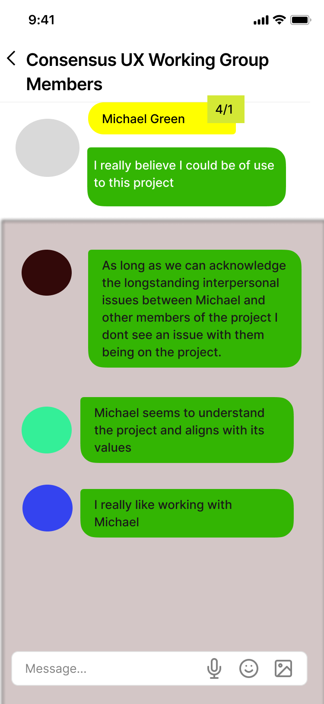
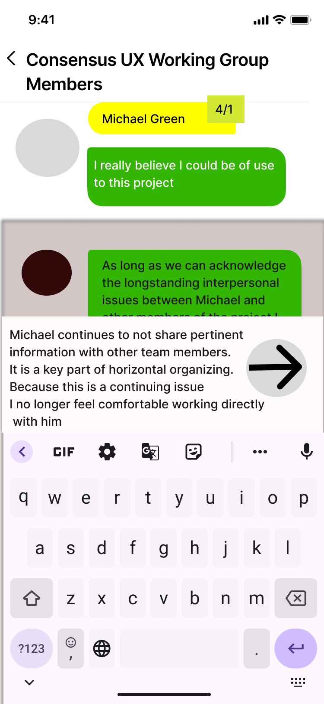
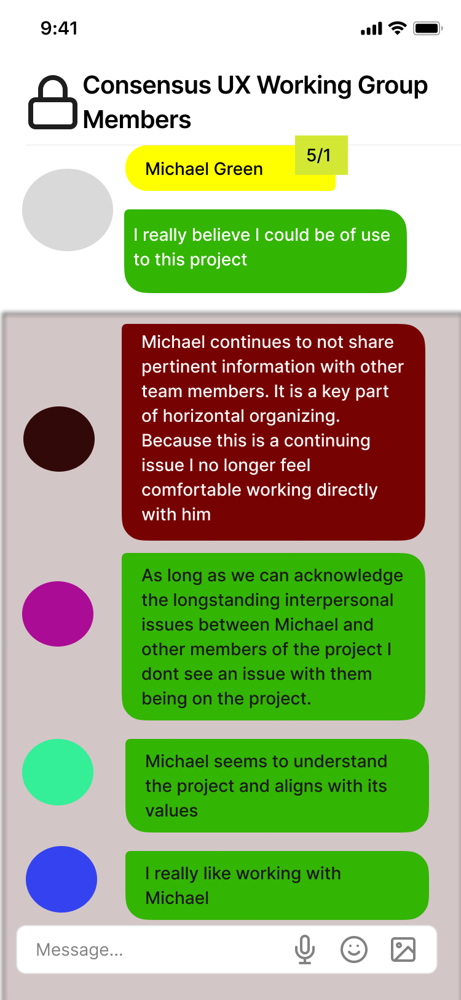
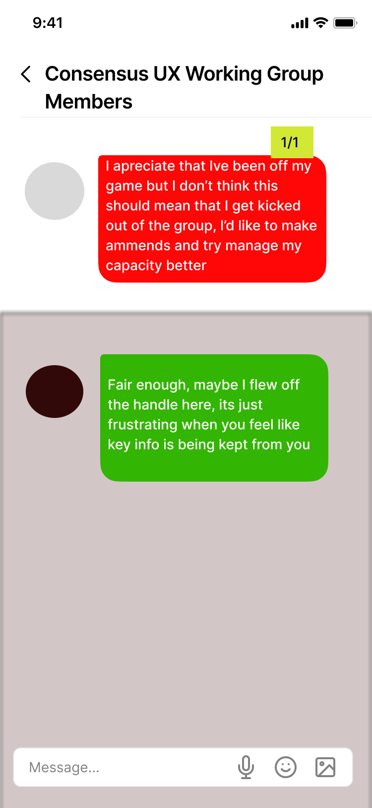

# Soft Lock Disputes

> This feature is planned. No production code has been written.
{: .planned }

Soft Lock is a novel conflict resolution mechanism designed for horizontal groups that have no administrators and no unilateral removal authority. When a member believes another has committed a serious infraction, they can initiate a dispute that mutually immobilizes both parties until one party concedes. The group provides input through chain messages but cannot directly vote to remove anyone.

---

## Overview

Standard moderation tools are incompatible with horizontal organizing. Admin bans are authoritarian; majority votes can be weaponized against minorities; doing nothing rewards bad actors. Soft Lock offers a different model:

- **The dispute is costly for both parties** — both challenger and accused are locked out of the app during the dispute, incentivizing only genuine grievances
- **The group has influence but not authority** — members can post supportive or critical chain messages, but no one can force a resolution
- **Resolution requires concession** — one party must voluntarily yield; there is no external arbiter

---

## How It Works

### Step 1 — Instigation

1. The challenging member navigates to the offending member's profile
2. They enter a complaint message describing the infraction
3. They perform a **consent check** on that complaint, selecting a strong dissent level (which registers a `red_score + 1` against the accused)
4. The system presents a **warning**: initiating the soft lock will restrict both the challenger's and the accused's access to the app

### Step 2 — Soft Lock Activation

If the challenger confirms:
- Both the challenger and the accused are placed in **soft lock state**
- Both users can only access their own profile pages within the app
- All other app functionality is blocked for both parties
- All other group members receive a **push notification** and a red dot indicator

### Step 3 — Group Response

While the dispute is active:
- Other members can view the dispute in the group's chat
- Members can post **chain messages** expressing support for the challenger or the accused, or offering neutral mediation
- No member can force a resolution — there is no vote, no admin override, no automatic timeout (see Open Questions)

### Step 4 — Resolution

Two resolution paths are available:

---

## Resolution Paths

### Resolution A — Accused Concedes (Voluntary Departure)

1. The accused member places a **negative vouch on their own self-vouch**
2. The accused may write a **final statement** visible to all members
3. The accused **loses access to the group**
4. The soft lock is released for the challenger
5. The accused's record remains in the members list (red, removed tier)

### Resolution B — Challenger Concedes

1. The challenger **affirms a dissenting vote on their own negative vouch** (effectively withdrawing the accusation)
2. Both parties are **released from soft lock**
3. Both remain in the group
4. The dispute is marked resolved; the chain record is preserved

---

## The Padlock UI

During a soft lock, the standard **back arrow** in the navigation header is replaced by a **padlock icon**. This communicates the locked state visually and persistently.

A **"Concede the Point"** button appears on the locked profile screen as a shortcut to initiate either resolution path. The button label and behavior differ depending on whether the user is the challenger or the accused.

---

## Chain-Based Group Pressure

The soft lock system uses social dynamics rather than voting mechanics to influence outcomes. This is intentional.

| Scenario | Likely Outcome |
|----------|----------------|
| Group posts chain messages supporting the challenger | Accused may judge the social cost too high and voluntarily concede |
| A supporter of the challenger independently soft-locks the accused | Accused faces a second simultaneous dispute (see Open Questions) |
| Group posts chain messages supporting the accused | Challenger may judge that they misjudged the situation and concede |
| Group is divided or silent | Both parties remain locked until one decides to concede |

The absence of a direct vote is deliberate. Votes can be mobilized, coordinated, or dominated by factions. Chain-based social pressure requires actual engagement and reasoning, not just a button press.

---

## Vouch System Interaction

Soft lock interacts with the vouching system:
- During a dispute, a member's vouch count cannot drop below threshold to trigger automatic removal — the dispute takes precedence
- After resolution A (accused concedes), the accused is removed regardless of vouch standing
- After resolution B (challenger concedes), normal vouch dynamics resume for both parties

---

## Wireframes









---

## Technical Spec

### Data Model

```
Dispute
  id                      uuid
  challenger_id           FK → User
  accused_id              FK → User
  group_id                FK → Group
  complaint_message_id    FK → Message
  status                  enum(active | resolved_a | resolved_b | cancelled)
  created_at              timestamp
  resolved_at             timestamp

SoftLock
  user_id                 FK → User
  dispute_id              FK → Dispute
  locked_at               timestamp
  unlocked_at             timestamp

DisputeChainMessage
  dispute_id              FK → Dispute
  author_id               FK → User
  content                 text
  support_direction       enum(challenger | accused | neutral)
  created_at              timestamp
```

### Key Behaviors

- Both parties are locked **simultaneously** when the challenger confirms the dispute
- **App access** during lock is restricted to profile-only: users can read their profile, their vouch chain, and the dispute chain; they cannot post to any group chat or initiate any other action
- **Push notifications** are sent to all group members on dispute creation, and on resolution
- **Resolution** triggers: soft lock records receive `unlocked_at` timestamp; `Dispute.status` is updated; app access restored
- Dispute history is **preserved permanently** — records are not deleted after resolution, for group transparency

---

## Game Theory Notes

The soft lock mechanism is designed with the following incentive structure:

| Property | Effect |
|----------|--------|
| Soft lock is costly for the challenger | Deters frivolous accusations; only genuine grievances are worth initiating |
| No external arbiter | Forces the parties to reach their own resolution; prevents authority capture |
| Group input without group authority | Provides social information without creating a majority-vote weapon |
| Dispute record is permanent | Bad actors cannot erase their history; patterns of behavior are visible |
| Resolution requires explicit concession | No silent disappearances; departures are visible and contextualized |

---

## Open Questions

- **Simultaneous disputes**: Can a member be involved in multiple soft locks at once (as challenger in one, accused in another)? What is the UX for overlapping lock states?
- **Time limit**: Should there be a maximum duration for a soft lock before some automatic resolution kicks in? Indefinite locks could be used as a harassment tool against the challenger as much as the accused.
- **Read access during lock**: Can locked members read (but not write to) group chats? Full read access provides context; no read access prevents further provocation.
- **Federation interaction**: If a member is soft-locked in one group, are they also restricted in federated shared chats involving that group?
